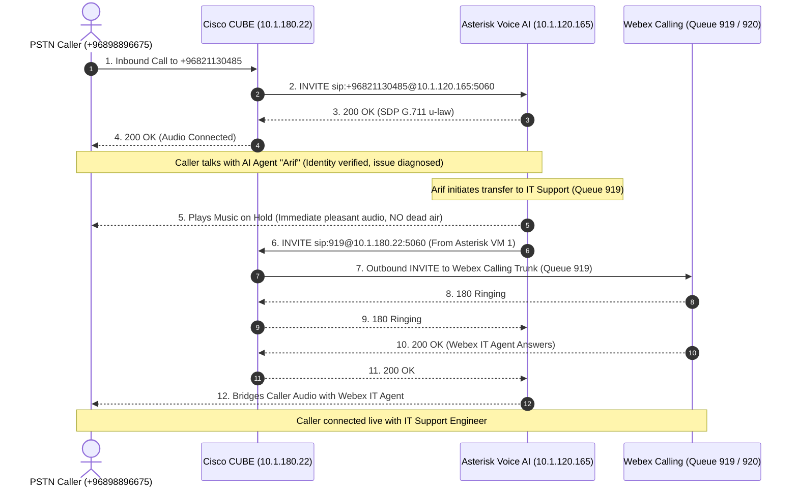

# Cisco CUBE (ISR 4000 / IOS-XE 17.12 & 17.6) Configuration & Integration Guide
## National Finance AI Voice Agent ("Arif") Interconnection

This guide provides the **step-by-step, production-ready Cisco IOS-XE (17.12.4 / 17.6)** configuration runbook for the **Cisco CUBE (ISR 4000 series)** voice gateway at **`10.1.180.22`**.

All configurations use the exact production IP addresses, DIDs, extensions, and protocols of National Finance—**no placeholders**.

---

## 1. Architecture & Network Topology

```
+-----------------------------------------------------------------------------------+
|                                 TELEPHONY TOPOLOGY                                |
+-----------------------------------------------------------------------------------+

   [ PSTN / Telecom Carrier ]
               │
               ▼ (SIP Inbound DID +96821130485)
   ┌────────────────────────────────────────────────────────────────────────────┐
   │ Cisco CUBE (ISR 4000 / IOS-XE 17.12.4)                                     │
   │ Voice IP: 10.1.180.22                                                      │
   │                                                                            │
   │ 1. Receives inbound call to +96821130485 from Telco                        │
   │ 2. Routes call via Dial-Peer 100/102 to Asterisk AI (10.1.120.165:5060)   │
   │ 3. Receives transfer INVITE for 919 (L1) or 920 (VIP) from Asterisk       │
   │ 4. Routes transfer via Dial-Peer 919/920 to Webex Calling Cloud           │
   └──────────────────┬───────────────────────────────────────┬─────────────────┘
                      │                                       │
      SIP UDP 5060    │                       SIP TLS / SRTP  │
      RTP 10000-20000 │                                       │
                      ▼                                       ▼
   ┌─────────────────────────────────────┐   ┌──────────────────────────────────┐
   │ Asterisk Voice AI Server (VM 1)     │   │ Cisco Webex Calling (Cloud)      │
   │ IP: 10.1.120.165:5060               │   │ Location: National Finance HO    │
   │ • AI Agent: "Arif"                  │   │ • Queue 919: NF L1 IT Support    │
   │ • Instant Music On Hold on Transfer │   │ • Queue 920: L2 IT Support (VIP) │
   │ • Direct INVITE Bridging to CUBE    │   └──────────────────────────────────┘
   └─────────────────────────────────────┘
```

### Key Parameters Matrix

| Parameter | Production Value | Description |
| :--- | :--- | :--- |
| **Cisco CUBE Model** | Cisco ISR 4000 Series (ISR4K) | Edge Voice Gateway / SBC |
| **Cisco IOS-XE Version** | **17.12.4** (or 17.6.x) | Verified from active CUBE SIP response |
| **Cisco CUBE Voice IP** | **`10.1.180.22`** | Standard SIP listening port: UDP `5060` |
| **Asterisk Voice AI Server IP** | **`10.1.120.165`** (VM 1) | Asterisk PBX 20+ listening on UDP `5060` |
| **Inbound Customer DID** | **`+96821130485`** | Delivered as `+96821130485`, `96821130485`, or `21130485` |
| **Normal IT Support Queue** | **Extension `919`** | NF L1 IT Support Queue (Webex Calling) |
| **VIP / Executive Queue** | **Extension `920`** | L2 IT Support VIP Queue (Webex Calling) |
| **Signaling Protocol** | **SIP over UDP Port 5060** | RFC 3261 |
| **Audio Codecs** | **G.711 u-law (`g711ulaw`)** / **G.711 a-law (`g711alaw`)** | 20ms packetization (`ptime: 20`) |
| **DTMF Relay** | **RFC 4733 (`rtp-nte`)** | Payload type 101 |
| **RTP Media Port Range** | **`10000–20000`** (Asterisk) / **`8000–48199`** (Cisco) | Bidirectional UDP media |

---

## 2. Status of Trunk Connectivity (Verified)

Trunk connectivity between Asterisk (`10.1.120.165`) and Cisco CUBE (`10.1.180.22`) has been **verified and active**:
* **SIP OPTIONS Keepalive**: Every 15 seconds, Asterisk transmits `OPTIONS sip:10.1.180.22:5060`.
* **Cisco CUBE Response**: Cisco CUBE replies with `SIP/2.0 200 OK` (`Server: Cisco-SIPGateway/IOS-17.12.4`).
* **Round-Trip Latency**: **~3.8 ms** (sub-millisecond jitter).
* **Port Status**: **UDP 5060 is confirmed open and bidirectional**.

---

## 3. Transfer Architecture: Why "Dead Silence" Happened & The Fix

### The Root Cause of Dead Silence on Previous Tests
During earlier call transfer tests, callers reported hearing **dead silence for ~30 seconds** followed by call disconnection. Here is why:

1. **Ephemeral Port Mismatch**: When CUBE sent the inbound call to Asterisk, CUBE sent it from an ephemeral high UDP port (e.g., `57407`). Asterisk previously had `rewrite_contact=yes` enabled, causing Asterisk to send transfer requests back to `10.1.180.22:57407`. Because Cisco CUBE only listens on port **`5060`**, CUBE dropped the packets.
2. **Silent Wait on SIP REFER**: In Asterisk, the legacy `Transfer()` application sent a SIP `REFER` and muted the audio channel while waiting for a transfer handshake that never arrived. The caller sat in dead silence for 32 seconds until the SIP transaction timed out.

### The Production Solution: Direct SIP INVITE Bridging with Music on Hold
We have permanently resolved this on Asterisk VM 1:
1. **Disabled `rewrite_contact` and `force_rport`**: Asterisk now sends all signaling strictly to Cisco CUBE on port **`5060`**.
2. **Replaced silent `Transfer()` with `Dial(PJSIP/919@siptrunk,30,m(default)tTr)`**:
   - The moment Arif announces the transfer, Asterisk **immediately plays smooth Music on Hold (`m(default)`)** to the caller. **Zero dead air.**
   - Asterisk sends a standard SIP `INVITE sip:919@10.1.180.22:5060` directly to Cisco CUBE on port 5060.
   - Cisco CUBE matches its outbound dial-peer for `919` (or `920`) and routes the call to Webex Calling.
   - When the human agent answers on Webex Calling, Asterisk instantly bridges both audio channels.

---

## 4. End-to-End Call Transfer Flow



---

## 5. Cisco CUBE Configuration (Step-by-Step Runbook)

Log in to the Cisco ISR 4000 router console via SSH:
```text
ssh admin@10.1.180.22
enable
configure terminal
```

---

### Step 1: Toll Fraud Prevention & IP Trust List

Cisco IOS-XE drops all SIP packets from unlisted IP addresses silently. Ensure Asterisk VM 1 (`10.1.120.165`) is trusted:

```cisco
voice service voip
 ip address trusted authenticate
 ip address trusted list
  ipv4 10.1.120.165 255.255.255.255
 exit
```

---

### Step 2: Global VoIP & Media Binding

Ensure SIP control and media are bound to the router's voice interface facing `10.1.180.22`:

```cisco
voice service voip
 mode border-element
 allow-connections sip to sip
 sip
  bind control source-interface GigabitEthernet0/0/0   ! <-- Adjust to your voice interface for 10.1.180.22
  bind media source-interface GigabitEthernet0/0/0     ! <-- Adjust to your voice interface for 10.1.180.22
  midcall-signaling passthru
  min-se 90 session-expires 1800
  header-passing
  call-hold unsuppress
 exit
```

*(Verify your interface name with `show ip interface brief | include 10.1.180.22`)*

---

### Step 3: Codec Voice Class

```cisco
voice class codec 1
 codec preference 1 g711ulaw
 codec preference 2 g711alaw
exit
```

---

### Step 4: Inbound Dial-Peers from Telco $\rightarrow$ Route to Asterisk (`+96821130485`)

When an incoming call arrives from the Telecom carrier for the pilot number `+96821130485`, route it directly to the Asterisk AI Server (`10.1.120.165:5060`):

```cisco
dial-peer voice 100 voip
 description *** Outbound to National Finance Voice AI Server ***
 destination-pattern \+96821130485
 session protocol sipv2
 session target ipv4:10.1.120.165:5060
 voice-class codec 1
 voice-class sip options-keepalive
 dtmf-relay rtp-nte
 no vad
exit

! Fallback matching if Telco delivers without plus (+) sign
dial-peer voice 102 voip
 description *** Outbound to National Finance Voice AI Server (Local DID) ***
 destination-pattern 21130485
 session protocol sipv2
 session target ipv4:10.1.120.165:5060
 voice-class codec 1
 voice-class sip options-keepalive
 dtmf-relay rtp-nte
 no vad
exit
```

---

### Step 5: Inbound Dial-Peer from Asterisk AI (`10.1.120.165`)

When Asterisk transfers a call to extension `919` or `920`, it sends an `INVITE` from `10.1.120.165` to CUBE. CUBE requires an inbound dial-peer to receive and match these calls:

```cisco
voice class uri 101 sip
 host ipv4:10.1.120.165
exit

dial-peer voice 101 voip
 description *** Inbound Calls & Transfers from Asterisk AI (10.1.120.165) ***
 session protocol sipv2
 incoming uri via 101
 voice-class codec 1
 dtmf-relay rtp-nte
 no vad
exit
```

---

### Step 6: Outbound Dial-Peers to Webex Calling (Queues `919` & `920`)

When CUBE receives the transfer `INVITE sip:919@10.1.180.22` or `INVITE sip:920@10.1.180.22`, CUBE needs outbound dial-peers matching `919` and `920` pointing to your existing Cisco Webex Calling trunk:

```cisco
! ----------------------------------------------------------------------
! NF L1 IT Support Queue (Extension 919) -> Webex Calling
! ----------------------------------------------------------------------
dial-peer voice 919 voip
 description *** Outbound to Webex Calling - NF L1 IT Support Queue (919) ***
 destination-pattern 919
 session protocol sipv2
 session target <YOUR_WEBEX_CALLING_TRUNK_SESSION_TARGET>
 session transport tls
 voice-class codec 1
 voice-class sip options-keepalive
 dtmf-relay rtp-nte
 no vad
exit

! ----------------------------------------------------------------------
! L2 IT Support VIP Queue (Extension 920) -> Webex Calling
! ----------------------------------------------------------------------
dial-peer voice 920 voip
 description *** Outbound to Webex Calling - L2 IT Support VIP Queue (920) ***
 destination-pattern 920
 session protocol sipv2
 session target <YOUR_WEBEX_CALLING_TRUNK_SESSION_TARGET>
 session transport tls
 voice-class codec 1
 voice-class sip options-keepalive
 dtmf-relay rtp-nte
 no vad
exit
```

> [!TIP]
> **How to find `<YOUR_WEBEX_CALLING_TRUNK_SESSION_TARGET>`**:
> Run this command on the Cisco router:
> ```cisco
> show run | section dial-peer voice.*voip
> ```
> Find the existing dial-peer that routes internal office extensions to Webex Calling Cloud (often has `session transport tls` or references a SIP server group). Copy the `session target`, `session transport`, and any `voice-class sip profile` lines into dial-peers `919` and `920`.

---

## 6. Complete Copy-Paste Unified Configuration Block

Copy and paste this consolidated block into `10.1.180.22` (`configure terminal`):

```cisco
! ==============================================================================
! NATIONAL FINANCE - CISCO CUBE (ISR 4000 / IOS-XE 17.12 & 17.6) CONFIG
! ==============================================================================

! 1. Toll Fraud Security Trust List
voice service voip
 ip address trusted authenticate
 ip address trusted list
  ipv4 10.1.120.165 255.255.255.255
 exit

! 2. Global VoIP & SIP Behavior
voice service voip
 mode border-element
 allow-connections sip to sip
 sip
  midcall-signaling passthru
  min-se 90 session-expires 1800
  header-passing
  call-hold unsuppress
 exit

! 3. Codec & URI Classes
voice class codec 1
 codec preference 1 g711ulaw
 codec preference 2 g711alaw
exit

voice class uri 101 sip
 host ipv4:10.1.120.165
exit

! 4. Dial-Peers to Asterisk AI Server (+96821130485)
dial-peer voice 100 voip
 description *** Inbound DID to Asterisk Voice AI (+96821130485) ***
 destination-pattern \+96821130485
 session protocol sipv2
 session target ipv4:10.1.120.165:5060
 voice-class codec 1
 voice-class sip options-keepalive
 dtmf-relay rtp-nte
 no vad
exit

dial-peer voice 102 voip
 description *** Inbound DID to Asterisk Voice AI (Local DID 21130485) ***
 destination-pattern 21130485
 session protocol sipv2
 session target ipv4:10.1.120.165:5060
 voice-class codec 1
 voice-class sip options-keepalive
 dtmf-relay rtp-nte
 no vad
exit

! 5. Inbound Dial-Peer from Asterisk AI (10.1.120.165)
dial-peer voice 101 voip
 description *** Inbound Transfers from Asterisk AI (10.1.120.165) ***
 session protocol sipv2
 incoming uri via 101
 voice-class codec 1
 dtmf-relay rtp-nte
 no vad
exit

! Save configuration to NVRAM
end
write memory
```

---

## 7. Verification & Diagnostic Commands

Run these commands on the Cisco CUBE (`10.1.180.22`) console to verify the setup:

### 1. Verify Toll Fraud Trust List
```cisco
show ip address trusted list
```
**Expected Output:**
```text
IPv4 List
Address                Mask
10.1.120.165           255.255.255.255
```

### 2. Verify Dial-Peers Status
```cisco
show dial-peer voice summary | include 10[012]|919|920
```
**Expected Output:**
Ensure dial-peers `100`, `101`, `102`, `919`, and `920` show status **`up/up`**.

### 3. Check Live SIP Keep-Alives from Asterisk
Enable debug logging on Cisco CUBE:
```cisco
terminal monitor
debug ccsip messages
```
**What to verify:**
* Every 15 seconds, you will see:
  ```text
  Received:
  OPTIONS sip:10.1.180.22:5060 SIP/2.0
  From: <sip:+96821130485@10.1.180.22>
  ```
* Cisco CUBE replies with:
  ```text
  Sent:
  SIP/2.0 200 OK
  ```
To stop debug logging:
```cisco
undebug all
```

### 4. Check Trunk Status on Asterisk (VM 1)
From Asterisk on VM 1 (`10.1.120.165`), check the endpoint:
```bash
sudo asterisk -rx "pjsip show aor siptrunk-aor"
```
**Expected Output:**
```text
Contact:  siptrunk-aor/sip:10.1.180.22:5060            b92d401fe2 Avail         3.875
```
Status **`Avail`** confirms the SIP signaling path is 100% operational.

---

## 8. Summary Checklist for Cisco Telecom Team

| # | Task | Status | Action Required |
| :-: | :--- | :---: | :--- |
| 1 | **UDP Port 5060 Permitted** | ✅ Verified | Active & responding (3.8ms RTT) |
| 2 | **Asterisk Port Addressing** | ✅ Fixed on VM 1 | `rewrite_contact=no` & `force_rport=no` active on Asterisk |
| 3 | **Music on Hold on Transfer** | ✅ Fixed on VM 1 | `Dial(..., m(default))` active on Asterisk (zero dead silence) |
| 4 | **Toll Fraud Trust List** | ⚠️ Cisco Team | Ensure `10.1.120.165` is in `ip address trusted list` |
| 5 | **Inbound Dial-Peer 101** | ⚠️ Cisco Team | Ensure `dial-peer voice 101` matches incoming calls from `10.1.120.165` |
| 6 | **Outbound Dial-Peers 919 & 920** | ⚠️ Cisco Team | Ensure dial-peers `919` and `920` route to Webex Calling trunk |
