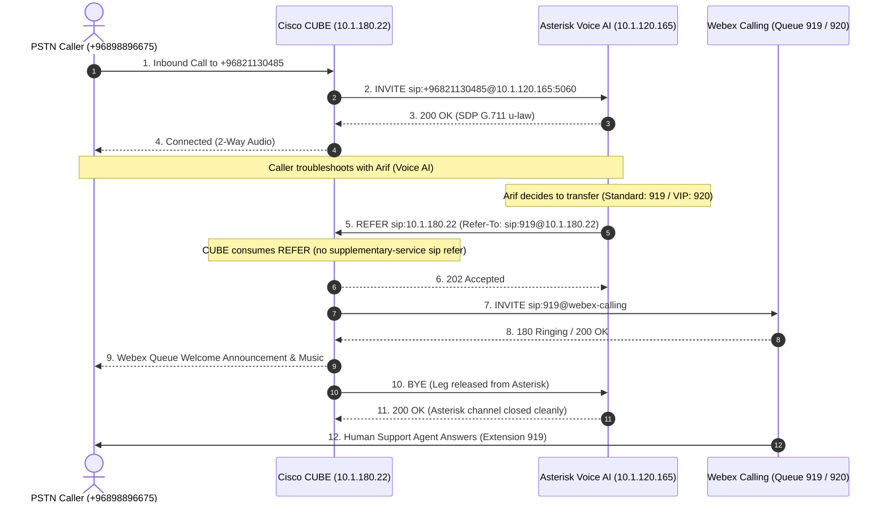

# Cisco CUBE (ISR 4000 / IOS-XE 17.6) Configuration & Integration Guide
## National Finance AI Voice Agent ("Arif") Interconnection

This guide provides the **step-by-step, production-ready Cisco IOS-XE 17.6** configuration runbook for the **Cisco CUBE (ISR 4000 series)** router at **`10.1.180.22`**.

All configurations use the exact production IP addresses, DIDs, extensions, and protocols of National Finance—**no placeholders**.

---

## 1. Architecture & Network Topology

```
+-----------------------------------------------------------------------------------+
|                                 TELEPHONY TOPOLOGY                                |
+-----------------------------------------------------------------------------------+

   [ PSTN / Telecom Carrier ]
               │
               ▼ (SIP Inbound)
   ┌────────────────────────────────────────────────────────────────────────────┐
   │ Cisco CUBE (ISR 4000 / IOS-XE 17.6)                                        │
   │ IP: 10.1.180.22                                                            │
   │                                                                            │
   │ 1. Receives DID +96821130485 from Telco                                    │
   │ 2. Routes call to Asterisk AI Server (10.1.120.165:5060)                  │
   │ 3. Receives SIP REFER (or INVITE) for 919 (L1) & 920 (VIP L2)              │
   │ 4. Consumes REFER and bridges caller to Webex Calling Queues              │
   └──────────────────┬───────────────────────────────────────┬─────────────────┘
                      │                                       │
      SIP UDP 5060    │                       SIP TLS / SRTP  │
      RTP 10000-20000 │                                       │
                      ▼                                       ▼
   ┌─────────────────────────────────────┐   ┌──────────────────────────────────┐
   │ Asterisk Voice AI Server (VM 1)     │   │ Cisco Webex Calling (Cloud)      │
   │ IP: 10.1.120.165:5060               │   │ Location: National Finance HO    │
   │ • AI Agent: "Arif"                  │   │ • Queue 919: NF L1 IT Support    │
   │ • Fast-recovery SIP REFER transfer  │   │ • Queue 920: L2 IT Support (VIP) │
   └─────────────────────────────────────┘   └──────────────────────────────────┘
```

### Key Parameters Matrix

| Parameter | Production Value |
| :--- | :--- |
| **Cisco CUBE Model** | Cisco ISR 4000 Series (ISR4K) |
| **Cisco IOS-XE Version** | **17.6** (e.g., 17.06.01a+) |
| **Cisco CUBE Voice IP** | **`10.1.180.22`** |
| **Asterisk Voice AI Server IP** | **`10.1.120.165`** (VM 1) |
| **Inbound Customer DID** | **`+96821130485`** (also delivered as `96821130485` or `21130485`) |
| **Normal IT Support Queue** | **Extension `919`** (`NF L1 IT Support`) |
| **VIP / Executive Queue** | **Extension `920`** (`L2 IT Support`) |
| **SIP Signaling Protocol** | **SIP over UDP Port 5060** |
| **Audio Codec** | **G.711 u-law (`g711ulaw`)** / **G.711 a-law (`g711alaw`)** |
| **DTMF Relay** | **RFC 4733 (`rtp-nte`)** |
| **RTP Media Port Range** | **`10000–20000`** (Asterisk) / **`8000–48199`** (Cisco) |

---

## 2. Network Firewall Requirements (Prerequisite)

Before applying Cisco configuration, the perimeter/internal firewall between VLAN **`10.1.120.0/24`** (Voice AI VMs) and VLAN **`10.1.180.0/24`** (Voice Gateway) must permit bidirectional traffic:

| Rule Name | Source IP | Destination IP | Protocol | Port Range | Action |
| :--- | :--- | :--- | :--- | :--- | :--- |
| **SIP-SIGNALING** | `10.1.120.165` | `10.1.180.22` | **UDP** | **`5060`** | **PERMIT** |
| **SIP-SIGNALING-REV**| `10.1.180.22` | `10.1.120.165` | **UDP** | **`5060`** | **PERMIT** |
| **RTP-MEDIA** | `10.1.120.165` | `10.1.180.22` | **UDP** | **`10000–20000`** | **PERMIT** |
| **RTP-MEDIA-REV** | `10.1.180.22` | `10.1.120.165` | **UDP** | **`10000–20000`** | **PERMIT** |

> [!IMPORTANT]
> VM 1 (`10.1.120.165`) has no local firewall filtering (`iptables -P INPUT ACCEPT`). If keep-alives or transfers fail, traffic is being dropped either at the intermediate network firewall or by Cisco Toll Fraud Prevention.

---

## 3. Cisco CUBE Configuration (Step-by-Step)

Log in to the Cisco ISR 4000 router console via SSH:
```text
ssh admin@10.1.180.22
enable
configure terminal
```

---

### Step 1: Toll Fraud Prevention & IP Trust List

Cisco IOS-XE 17.6 drops all SIP signaling (`OPTIONS`, `INVITE`, `REFER`) from unlisted IP addresses silently without sending any response. Add Asterisk VM 1 (`10.1.120.165`) to the trusted list:

```cisco
voice service voip
 ip address trusted authenticate
 ip address trusted list
  ipv4 10.1.120.165 255.255.255.255
 exit
```

---

### Step 2: Global VoIP & SIP Behavior (REFER Consumer)

Configure global SIP parameters. In Cisco IOS-XE 17.6, the command to handle transfers locally (acting as a **REFER Consumer** rather than passing the REFER to the PSTN telco) is:
```cisco
no supplementary-service sip refer
```

Apply global SIP settings:

```cisco
voice service voip
 mode border-element
 allow-connections sip to sip
 sip
  bind control source-interface GigabitEthernet0/0/0   ! <-- Adjust to your voice interface IP 10.1.180.22
  bind media source-interface GigabitEthernet0/0/0     ! <-- Adjust to your voice interface IP 10.1.180.22
  no supplementary-service sip refer
  midcall-signaling passthru
  min-se 90 session-expires 1800
  header-passing
  call-hold unsuppress
 exit
```

*(Note: Verify your interface name with `show ip interface brief | include 10.1.180.22`)*

---

### Step 3: Codec & URI Classes

Create voice classes for codecs and Asterisk matching:

```cisco
! Class for G.711 u-law with fallback to a-law
voice class codec 1
 codec preference 1 g711ulaw
 codec preference 2 g711alaw
exit

! Match Asterisk Voice AI server by IP
voice class uri 101 sip
 host ipv4:10.1.120.165
exit
```

---

### Step 4: Inbound Dial-Peer from Telco $\rightarrow$ Route to Asterisk (`+96821130485`)

When an incoming call arrives from the PSTN/Telecom carrier for the pilot number `+96821130485`, route it directly to the Asterisk AI Server:

```cisco
dial-peer voice 100 voip
 description *** Outbound to National Finance Voice AI Server ***
 destination-pattern \+96821130485
 session protocol sipv2
 session target ipv4:10.1.120.165:5060
 voice-class codec 1
 dtmf-relay rtp-nte
 no vad
 no supplementary-service sip refer
! Fallback matching if Telco delivers without plus (+) sign
dial-peer voice 102 voip
 description *** Outbound to National Finance Voice AI Server (Local DID) ***
 destination-pattern 21130485
 session protocol sipv2
 session target ipv4:10.1.120.165:5060
 voice-class codec 1
 dtmf-relay rtp-nte
 no vad
 no supplementary-service sip refer
exit
```

---

### Step 5: Inbound Dial-Peer from Asterisk (Signaling & Fallback Calls)

Create an inbound dial-peer that matches signaling and calls originating from the Asterisk AI Server (`10.1.120.165`):

```cisco
dial-peer voice 101 voip
 description *** Inbound Signaling & Transfers from Asterisk AI (10.1.120.165) ***
 session protocol sipv2
 incoming uri via 101
 voice-class codec 1
 dtmf-relay rtp-nte
 no vad
 no supplementary-service sip refer
exit
```

---

### Step 6: Outbound Dial-Peers to Webex Calling (Queues `919` & `920`)

When Asterisk initiates a transfer (either by sending `Refer-To: sip:919@10.1.180.22` or an `INVITE sip:919@...`), CUBE needs outbound dial-peers matching `919` and `920` pointing to your Cisco Webex Calling trunk:

```cisco
! ----------------------------------------------------------------------
! NF L1 IT Support Queue (Extension 919) -> Webex Calling
! ----------------------------------------------------------------------
dial-peer voice 919 voip
 description *** Route to Webex Calling - NF L1 IT Support Queue (919) ***
 destination-pattern 919
 session protocol sipv2
 session target <WEBEX_SESSION_TARGET>   ! <-- Replace with your existing Webex Calling session target (e.g. dns:10.x.x.x or sip-server)
 voice-class codec 1
 dtmf-relay rtp-nte
 no vad
exit

! ----------------------------------------------------------------------
! L2 IT Support VIP Queue (Extension 920) -> Webex Calling
! ----------------------------------------------------------------------
dial-peer voice 920 voip
 description *** Route to Webex Calling - L2 IT Support VIP Queue (920) ***
 destination-pattern 920
 session protocol sipv2
 session target <WEBEX_SESSION_TARGET>   ! <-- Replace with your existing Webex Calling session target
 voice-class codec 1
 dtmf-relay rtp-nte
 no vad
exit
```

> [!TIP]
> To find your router's existing Webex Calling session target or dial-peer group, run:
> ```cisco
> show run | section dial-peer voice.*voip
> ```
> Look for the existing dial-peer pointing to Webex Calling Cloud (often using TLS port 5061 or SRTP). Copy that `session target`, `session transport`, and `voice-class sip profile` lines into dial-peers `919` and `920`.

---

## 4. Complete Unified Configuration Block

Copy and paste this consolidated block into `10.1.180.22` (`configure terminal`):

```cisco
! ==============================================================================
! NATIONAL FINANCE - CISCO CUBE (ISR 4000 / IOS-XE 17.6) PRODUCTION CONFIG
! ==============================================================================

! 1. Toll Fraud Security Trust List
voice service voip
 ip address trusted authenticate
 ip address trusted list
  ipv4 10.1.120.165 255.255.255.255
 exit

! 2. Global VoIP & SIP Transfer Handling (REFER Consumer)
voice service voip
 mode border-element
 allow-connections sip to sip
 sip
  no supplementary-service sip refer
  midcall-signaling passthru
  min-se 90 session-expires 1800
  header-passing
  call-hold unsuppress
 exit

! 3. Classes
voice class codec 1
 codec preference 1 g711ulaw
 codec preference 2 g711alaw
exit

voice class uri 101 sip
 host ipv4:10.1.120.165
exit

! 4. Dial-Peer to Asterisk AI Server (+96821130485)
dial-peer voice 100 voip
 description *** Route to Asterisk Voice AI (+96821130485) ***
 destination-pattern \+96821130485
 session protocol sipv2
 session target ipv4:10.1.120.165:5060
 voice-class codec 1
 dtmf-relay rtp-nte
 no vad
 no supplementary-service sip refer
exit

dial-peer voice 102 voip
 description *** Route to Asterisk Voice AI (Local DID 21130485) ***
 destination-pattern 21130485
 session protocol sipv2
 session target ipv4:10.1.120.165:5060
 voice-class codec 1
 dtmf-relay rtp-nte
 no vad
 no supplementary-service sip refer
exit

! 5. Inbound Dial-Peer from Asterisk AI (10.1.120.165)
dial-peer voice 101 voip
 description *** Inbound Signaling from Asterisk AI (10.1.120.165) ***
 session protocol sipv2
 incoming uri via 101
 voice-class codec 1
 dtmf-relay rtp-nte
 no vad
 no supplementary-service sip refer
exit

! Save configuration to NVRAM
end
write memory
```

---

## 5. Verification & Live Diagnostic Commands

Run these verification commands on the Cisco CUBE (`10.1.180.22`) console to confirm the integration:

### 1. Verify Toll Fraud Trust List
```cisco
show ip address trusted list
```
**Expected Output:**
```text
IPv4 List
Address                Mask
10.1.120.165           255.255.255.255
```

### 2. Verify Dial-Peers are Active
```cisco
show dial-peer voice summary | include 10[012]|919|920
```
**Expected Output:**
Ensure dial-peers `100`, `101`, `102`, `919`, and `920` show status `up/up`.

### 3. Check Live SIP Keep-Alives from Asterisk
Enable debug logging on Cisco CUBE:
```cisco
terminal monitor
debug ccsip messages
```
**What to verify:**
* Every 15 seconds, you will see Asterisk (`10.1.120.165`) transmit:
  ```text
  Received:
  OPTIONS sip:10.1.180.22:5060 SIP/2.0
  From: <sip:+96821130485@10.1.180.22>
  ```
* Cisco CUBE must reply with:
  ```text
  Sent:
  SIP/2.0 200 OK
  ```
To stop debug logging:
```cisco
undebug all
```

### 4. Check Asterisk Reachability (On VM 1)
From Asterisk on VM 1 (`10.1.120.165`), check the trunk status:
```bash
sudo asterisk -rx "pjsip show aor siptrunk-aor"
```
**Expected Output:**
```text
Contact:  siptrunk-aor/sip:10.1.180.22:5060  Status: Reachable  RTT(ms): 1.450
```
Once the contact status switches to **`Reachable`**, the SIP signaling path is 100% established.

---

## 6. End-to-End Call Transfer Flow


