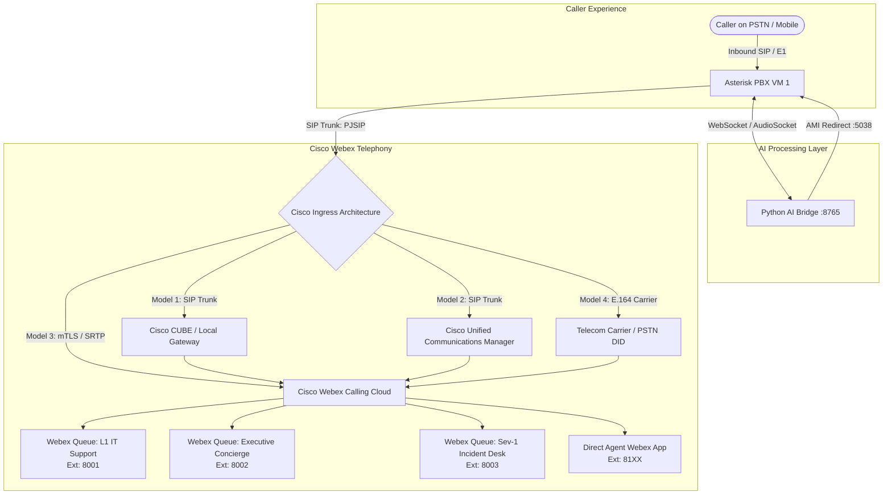

# Cisco Webex Integration & Call Transfer Architecture Guide

This guide details how to interconnect the **National Finance Voice AI IT Support Agent (Arif)** running on Asterisk PBX with **Cisco Webex** to transfer callers to human IT support agents seamlessly.

Because enterprise clients deploy Cisco Webex in different architectures, this document covers the **four standard enterprise deployment models**, Asterisk configuration, Cisco CUBE / Control Hub configuration, and caller context injection (screen-pop).

---

## 1. Executive Summary & Telephony Flow

When an inbound caller requires human intervention (e.g., executive VIP routing, critical Sev-1 incident, or diagnostic escalation):
1. **Arif Voice Bridge (`app/transfer.py`)**:
   - Injects contextual metadata (`AI_CALLER_NAME`, `AI_EMPLOYEE_ID`, `AI_TIER`, `AI_TICKET_NUMBER`, `AI_REASON`) onto the Asterisk channel via AMI.
   - Executes an AMI `Action: Redirect` targeting the configured escalation extension.
2. **Asterisk Dialplan (`/etc/asterisk/extensions.conf`)**:
   - Formats the Caller-ID name and outbound SIP `P-Asserted-Identity` / `Remote-Party-ID` headers with caller identity.
   - Forwards the audio call across a dedicated SIP trunk (`PJSIP/webex-trunk`) to the Cisco infrastructure.
3. **Cisco Webex Calling**:
   - Ingests the SIP call, applies call routing rules, and rings the target Webex Call Queue, Hunt Group, or individual agent desk phone / Webex desktop application.
4. **Graceful Fallback**:
   - If the Webex queue is unavailable or times out, Asterisk diverts the call to Arif's transfer recovery handler, offering a scheduled callback via `request_callback`.



---

## 2. Cisco Webex Deployment Models

Determine which deployment model the client uses:

| Model | Cisco Webex Flavor | Key Components | Complexity | Best For |
| :--- | :--- | :--- | :--- | :--- |
| **Model 1 (Most Common)** | **Webex Calling + Local Gateway (LGW)** | Cisco CUBE router (IOS-XE) on premise or cloud, Webex Calling Cloud | Medium | Enterprises with on-premise telecom, dedicated SIP trunks, and private subnets. |
| **Model 2** | **Cisco Unified Communications Manager (CUCM)** | On-premise CUCM (CallManager) cluster linked via Webex Cloud-Connected UC | Medium | Established enterprises transitioning from on-premise Cisco phones to Webex. |
| **Model 3** | **Pure Cloud Webex Calling (Premises-to-Cloud)** | Direct SIP Trunk between Asterisk and Webex Calling SBC via mTLS & SRTP | High | Pure cloud environments without on-premise Cisco SBCs. |
| **Model 4 (Quickest)** | **Carrier PSTN / DID Outdial** | Carrier E.164 trunk to Webex external DID | Low | Immediate pilot testing or zero-firewall setups. |

---

## 3. Model 1: Webex Calling with Local Gateway (CUBE)

In this architecture, National Finance has an on-premise or cloud-hosted **Cisco Unified Border Element (CUBE)** running Cisco IOS-XE that acts as a Local Gateway to Webex Calling.

### 3.1 Asterisk PJSIP Configuration (`/etc/asterisk/pjsip.conf`)

Add the following trunk configuration to `/etc/asterisk/pjsip.conf`:

```ini
; =============================================================================
; Cisco Webex Local Gateway (CUBE) SIP Trunk
; =============================================================================

; 1. UDP Transport (Use transport-tls if client requires SIP TLS)
[transport-udp]
type=transport
protocol=udp
bind=0.0.0.0:5060

; 2. Trunk Endpoint
[webex-cube-trunk]
type=endpoint
transport=transport-udp
context=from-webex
disallow=all
allow=ulaw
allow=alaw
aors=webex-cube-aor
direct_media=no
trust_id_inbound=yes
send_rpid=yes
send_pai=yes
rpid_immediate=yes
100rel=yes

; 3. Address of Record (Points to Cisco CUBE IP)
[webex-cube-aor]
type=aor
contact=sip:<CISCO_CUBE_IP>:5060

; 4. IP-Based Identify Match (ACL peering)
[webex-cube-identify]
type=identify
endpoint=webex-cube-trunk
match=<CISCO_CUBE_IP>
```

> [!NOTE]
> Replace `<CISCO_CUBE_IP>` with the internal private IP address of the client's Cisco CUBE / SBC router.

### 3.2 Asterisk Dialplan Configuration (`/etc/asterisk/extensions.conf`)

Configure escalation routing and caller ID injection in `/etc/asterisk/extensions.conf`:

```ini
[from-internal]
; -----------------------------------------------------------------------------
; AI Support Voice Agent Entry Point
; -----------------------------------------------------------------------------
exten => 7000,1,Answer()
 same => n,Set(JITTERBUFFER(adaptive)=default)
 same => n,Set(DENOISE(rx)=on)
 same => n,Set(DENOISE(tx)=on)
 same => n,AudioSocket(127.0.0.1:8765)
 same => n,Hangup()

; -----------------------------------------------------------------------------
; Escalation Queues -> Cisco Webex Calling via CUBE
; -----------------------------------------------------------------------------
; 1. Standard L1 IT Support Queue (Webex Ext: 8001)
exten => 7001,1,NoOp(Transferring to Webex L1 Support: ${AI_CALLER_NAME})
 same => n,Set(CALLERID(name)=IT: ${AI_CALLER_NAME})
 same => n,Set(PJSIP_HEADER(add,X-Employee-ID)=${AI_EMPLOYEE_ID})
 same => n,Set(PJSIP_HEADER(add,X-Ticket-Ref)=${AI_TICKET_NUMBER})
 same => n,Dial(PJSIP/8001@webex-cube-trunk,30,tT)
 same => n,GotoIf($["${DIALSTATUS}" = "NOANSWER" | "${DIALSTATUS}" = "BUSY"]?transfer_failed,s,1)
 same => n,Hangup()

; 2. Executive & VIP Concierge Desk (Webex Ext: 8002)
exten => 7002,1,NoOp(Transferring to Webex VIP Desk: ${AI_CALLER_NAME})
 same => n,Set(CALLERID(name)=VIP: ${AI_CALLER_NAME})
 same => n,Set(PJSIP_HEADER(add,X-VIP-Priority)=P0_EXECUTIVE)
 same => n,Dial(PJSIP/8002@webex-cube-trunk,30,tT)
 same => n,GotoIf($["${DIALSTATUS}" = "NOANSWER" | "${DIALSTATUS}" = "BUSY"]?transfer_failed,s,1)
 same => n,Hangup()

; 3. Sev-1 Critical Incident Response (Webex Ext: 8003)
exten => 7003,1,NoOp(Transferring to Webex Emergency Desk: ${AI_REASON})
 same => n,Set(CALLERID(name)=EMERGENCY: ${AI_REASON})
 same => n,Set(PJSIP_HEADER(add,X-Incident-Priority)=CRITICAL_SEV1)
 same => n,Dial(PJSIP/8003@webex-cube-trunk,20,tT)
 same => n,GotoIf($["${DIALSTATUS}" = "NOANSWER" | "${DIALSTATUS}" = "BUSY"]?transfer_failed,s,1)
 same => n,Hangup()

; 4. Direct Webex Extension Dialing (Supports any 4-digit Webex Extension 8000-8999)
exten => _8XXX,1,NoOp(Direct Transfer to Webex Extension ${EXTEN})
 same => n,Set(CALLERID(name)=IT Support: ${AI_CALLER_NAME})
 same => n,Dial(PJSIP/${EXTEN}@webex-cube-trunk,30,tT)
 same => n,Hangup()

; -----------------------------------------------------------------------------
; Transfer Failure Fallback
; -----------------------------------------------------------------------------
[transfer_failed]
exten => s,1,NoOp(Transfer to Webex failed: ${DIALSTATUS})
 same => n,Playback(transfer-failed)
 same => n,Hangup()
```

### 3.3 Cisco CUBE Configuration (Client Telephony Engineer)

Provide the following configuration to the client's Cisco Network/Voice engineer for implementation on the Cisco CUBE router (Cisco IOS-XE):

```cisco
! =============================================================================
! 1. SIP Service Configuration
! =============================================================================
voice service voip
 ip address trusted list
  ipv4 <ASTERISK_IP> 255.255.255.255
 address-hiding
 mode border-element
 media flow-through
 sip
  bind control source-interface GigabitEthernet0/0/1
  bind media source-interface GigabitEthernet0/0/1
  header-passing
  midcall-signaling passthru

! =============================================================================
! 2. Inbound Dial-Peer (From Asterisk PBX)
! =============================================================================
dial-peer voice 1000 voip
 description INBOUND FROM ASTERISK AI SUPPORT AGENT
 translation-profile incoming T-IN-ASTERISK
 session protocol sipv2
 incoming called-number [78]...
 codec g711ulaw
 dtmf-relay rtp-nte
 no vad

! =============================================================================
! 3. Outbound Dial-Peer (To Cisco Webex Calling Cloud)
! =============================================================================
dial-peer voice 2000 voip
 description OUTBOUND TO WEBEX CALLING CLOUD
 destination-pattern 8...
 session protocol sipv2
 session target dns:cisco-lgw.webex.com
 session transport tls
 srtp
 dtmf-relay rtp-nte
 codec g711ulaw
 no vad
```

---

## 4. Model 2: Cisco Unified Communications Manager (CUCM / CallManager)

If the client uses an on-premise CUCM cluster:

### 4.1 Asterisk PJSIP Configuration (`/etc/asterisk/pjsip.conf`)

```ini
[webex-cucm-trunk]
type=endpoint
transport=transport-udp
context=from-cucm
disallow=all
allow=ulaw
allow=alaw
aors=webex-cucm-aor
direct_media=no
send_rpid=yes
send_pai=yes

[webex-cucm-aor]
type=aor
contact=sip:<CUCM_PUBLISHER_IP>:5060

[webex-cucm-identify]
type=identify
endpoint=webex-cucm-trunk
match=<CUCM_PUBLISHER_IP>,<CUCM_SUBSCRIBER_IP>
```

### 4.2 CUCM Admin Console Steps (Client Telecom Team)
1. Navigate to **Device** $\rightarrow$ **Trunk** $\rightarrow$ **Add New**.
2. Select **Trunk Type**: `SIP Trunk`.
3. Set **Destination Address**: `<ASTERISK_IP>`, Port: `5060`.
4. Assign a **SIP Profile** with `Standard SIP Profile` and enable `Send Calling Party Info in Remote-Party-ID`.
5. Create a **Route Pattern**:
   - Pattern: `700[1-3]` or Webex Hunt Pilot (e.g. `8001`, `8002`, `8003`).
   - Route List: Pointing to the newly created Asterisk SIP Trunk.

---

## 5. Model 3: Direct Webex Calling Cloud (mTLS / SRTP)

For pure-cloud organizations without on-premise gateways, Asterisk connects directly to the Cisco Webex Calling SBC in the cloud.

### 5.1 Prerequisites
1. **Public Static IP** on the Asterisk PBX server (VM 1).
2. **Mutual TLS (mTLS) Certificate**: Signed by an approved Cisco CA (e.g. IdenTrust Commercial Root CA 1, DigiCert Global Root CA).
3. **FQDN**: A registered domain name resolving to Asterisk (e.g., `ai-voice.nationalfinance.com`).

### 5.2 Asterisk PJSIP TLS Configuration (`/etc/asterisk/pjsip.conf`)

```ini
; TLS Transport for Cisco Webex Cloud
[transport-tls]
type=transport
protocol=tls
bind=0.0.0.0:5061
cert_file=/etc/asterisk/keys/asterisk.crt
priv_key_file=/etc/asterisk/keys/asterisk.key
ca_list_file=/etc/ssl/certs/ca-certificates.crt
verify_client=yes
verify_server=yes
method=tlsv1_2

[webex-cloud-trunk]
type=endpoint
transport=transport-tls
context=from-webex-cloud
disallow=all
allow=ulaw
aors=webex-cloud-aor
media_encryption=sdes
direct_media=no
send_pai=yes
send_rpid=yes

[webex-cloud-aor]
type=aor
contact=sip:<TENANT_ID>.bcld.webex.com:5061;transport=tls
```

---

## 6. Model 4: Carrier PSTN / Direct Inward Dialing (DID) Outdial

If the client wants an immediate proof-of-concept without configuring CUBE or CUCM routes:

1. Obtain the **external telephone numbers (DIDs)** assigned to the Webex IT Support Hunt Group or individual agents (e.g., `+968 24 123456`).
2. Asterisk dials through the existing telecom provider trunk:
   ```ini
   exten => 7001,1,NoOp(Forwarding to Webex via Carrier DID)
    same => n,Set(CALLERID(num)=${AI_CALLER_NUMBER})
    same => n,Dial(PJSIP/+96824123456@carrier-trunk,30,tT)
    same => n,Hangup()
   ```

---

## 7. Cisco Webex Control Hub Configuration (Client Portal)

The client's Cisco Webex administrator performs the following in the [Cisco Webex Control Hub](https://admin.webex.com):

### 7.1 Setup Call Queues / Hunt Groups
1. Go to **Calling** $\rightarrow$ **Features** $\rightarrow$ **Call Queue** (or **Hunt Group**).
2. Create three dedicated queues:
   - **Queue 1 (L1 IT Support)**:
     - Name: `IT Service Desk L1`
     - Extension: `8001`
     - Policy: Longest idle / Round-robin across all L1 IT support agents.
   - **Queue 2 (Executive VIP Concierge)**:
     - Name: `IT Executive Support Desk`
     - Extension: `8002`
     - Policy: Simultaneous ring to Senior Operations / VIP technicians.
   - **Queue 3 (Critical Sev-1 Emergency)**:
     - Name: `IT Emergency Incident Desk`
     - Extension: `8003`
     - Policy: High-priority broadcast ring to on-call infrastructure engineers.

### 7.2 Internal Routing & Permissions
1. Under **Calling** $\rightarrow$ **Routing** $\rightarrow$ **Trunks**, verify that the Local Gateway / Asterisk peer status is **Online** (Green).
2. Ensure internal dial plan policies allow calls originating from the Asterisk trunk to reach internal extensions `8XXX`.

---

## 8. Voice Bridge Application Configuration (`.env`)

Configure the environment variables in `ai-support-agent/.env`:

```env
# =============================================================================
# Asterisk PBX & AMI Configuration
# =============================================================================
ASTERISK_AMI_HOST=127.0.0.1
ASTERISK_AMI_PORT=5038
ASTERISK_AMI_USER=ai_bridge_user
ASTERISK_AMI_SECRET=SuperSecretAmiPass2026!
ASTERISK_AMI_TLS=false

# Dialplan context where transfers are executed
ASTERISK_TRANSFER_CONTEXT=from-internal
ASTERISK_TRANSFER_PRIORITY=1

# =============================================================================
# Cisco Webex Escalation Targets
# =============================================================================
# Standard L1 IT Support Queue (points to extensions.conf 7001 -> Webex 8001)
ASTERISK_QUEUE_STANDARD=7001

# Executive Concierge Queue (points to extensions.conf 7002 -> Webex 8002)
ASTERISK_QUEUE_EXECUTIVE=7002

# Sev-1 Emergency Outage Queue (points to extensions.conf 7003 -> Webex 8003)
ASTERISK_QUEUE_EMERGENCY=7003
```

> [!TIP]
> If you wish to route directly to Webex extensions without using intermediate Asterisk aliases (`7001/7002/7003`), set `ASTERISK_QUEUE_STANDARD=8001`, `ASTERISK_QUEUE_EXECUTIVE=8002`, and `ASTERISK_QUEUE_EMERGENCY=8003` in `.env`.

---

## 9. Caller Context Screen-Pop Feature

When Asterisk transfers a call to Cisco Webex Calling, the receiving agent's Webex desktop application or desk phone can display rich caller metadata:

| Variable Injected by Arif | Asterisk SIP Header | Webex Display |
| :--- | :--- | :--- |
| `AI_CALLER_NAME` | `CALLERID(name)` | `IT: Salim Al Maskari` (Caller Name on screen) |
| `AI_EMPLOYEE_ID` | `X-Employee-ID: 1003` | Employee ID in SIP headers / CTI pop |
| `AI_TIER` | `X-VIP-Priority: P0_EXECUTIVE` | Priority badge on executive transfers |
| `AI_TICKET_NUMBER` | `X-Ticket-Ref: HD-2026-0042` | Auto-generated Helpdesk ticket number |
| `AI_REASON` | `X-Incident-Summary: VPN issue` | Issue context summary |

---

## 10. Firewall & Port Requirements

Ensure firewall rules allow bi-directional traffic between Asterisk (VM 1) and Cisco Webex CUBE / Cloud:

| Direction | Source | Destination | Protocol | Port Range | Purpose |
| :--- | :--- | :--- | :--- | :--- | :--- |
| In/Out | Asterisk VM 1 | Cisco CUBE | UDP/TCP | `5060` | SIP Signaling |
| In/Out | Asterisk VM 1 | Cisco CUBE / Webex | TLS (TCP) | `5061` | Secure SIP Signaling (mTLS) |
| In/Out | Asterisk VM 1 | Cisco CUBE / Webex | UDP | `10000 - 20000` | RTP Audio Streams |
| Internal | 127.0.0.1 | 127.0.0.1 | TCP | `5038` | Asterisk AMI (Local Python Bridge) |
| Internal | 127.0.0.1 | 127.0.0.1 | TCP | `8765` | AudioSocket WebSocket |

---

## 11. Verification & Testing Playbook

### Test 1: Verify PJSIP Trunk Registration & Health
On the Asterisk PBX server (VM 1):
```bash
# Check trunk status
asterisk -rx "pjsip show endpoints"

# Expected output:
# Endpoint:  webex-cube-trunk                                   Not in use    0 of inf
#     Aor:  webex-cube-aor                                              0
#   Contact:  webex-cube-aor/sip:<CISCO_CUBE_IP>:5060          Avail         1.240 ms
```

### Test 2: Perform Test Call to Webex Extension
Simulate an outbound call from Asterisk directly to the Webex L1 Support Queue (`8001`):
```bash
asterisk -rx "channel originate PJSIP/8001@webex-cube-trunk extension 7000@from-internal"
```
- **Expected Result**: The Webex app or desk phone assigned to extension `8001` rings. Upon answering, you hear Arif.

### Test 3: End-to-End AI Voice Transfer
1. Dial the AI IT Support line (`7000`) from an internal phone or softphone.
2. Authenticate as an employee (e.g., Salim Al Maskari, Employee ID `1003`).
3. State: *"I need to speak to an IT engineer please."*
4. Arif replies: *"Connecting you to our IT support specialist right now."*
5. Arif triggers `transfer_to_agent(queue_type="standard")`.
6. Asterisk AMI issues `Redirect` to extension `7001` $\rightarrow$ bridges to Webex `8001`.
7. The call transfers seamlessly without dead air. The Webex softphone displays: `IT: Salim Al Maskari`.

### Test 4: Live SIP Packet Inspection
If troubleshooting audio or signaling:
```bash
# Enable PJSIP logger in Asterisk console
asterisk -rx "pjsip set logger on"

# Follow SIP INVITE and 200 OK messages
tail -f /var/log/asterisk/messages | grep -E "INVITE|200 OK|BYE"
```

---

## 12. Checklist for Client Discovery Meeting

When meeting with the client's network and voice engineers, obtain the following answers:

- [ ] **Webex Flavor**: Are they using Webex Calling Cloud with an on-premise Local Gateway (CUBE), on-premise CUCM CallManager, or pure Webex Calling Cloud?
- [ ] **Gateway IP & Port**: What is the internal IP address and SIP port of their Cisco CUBE or CUCM publisher?
- [ ] **Signaling Protocol**: Is the trunk UDP, TCP, or TLS (with mutual certificates)?
- [ ] **Extension Scheme**: What are their IT support extension numbers?
  - Standard L1 IT Queue: `______`
  - VIP / Executive Desk: `______`
  - Critical Outage Desk: `______`
- [ ] **Audio Codec**: Do they enforce G.711u (`ulaw`), G.711a (`alaw`), or G.729?
- [ ] **ACL / Peering**: Have they added Asterisk's IP to the Cisco CUBE `ip address trusted list`?
