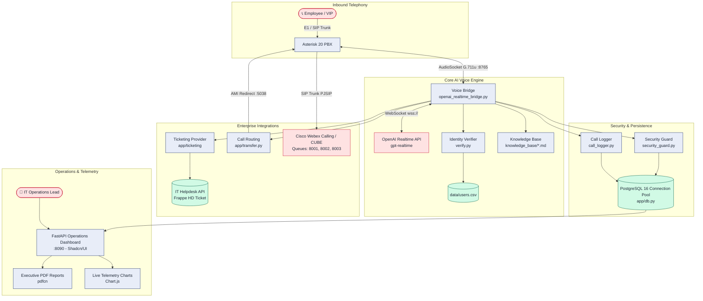

# National Finance — Enterprise AI IT Support Platform ("Arif")

[](https://www.python.org/)
[](https://www.asterisk.org/)
[](https://openai.com/)
[](https://www.postgresql.org/)
[](https://ui.shadcn.com/)
[](#security--governance)

An enterprise-grade, bilingual (English & Arabic) conversational Voice AI assistant ("Arif") designed for **National Finance**. The platform automates internal IT service desk operations by answering telephony calls, verifying employee credentials, conducting playbook-grounded troubleshooting, registering tickets in the IT Helpdesk, and escalating calls to human support queues and Cisco Webex Calling endpoints.

---

## 1. System Architecture



---

## 2. Core Capabilities

### 2.1 Conversational Voice AI Engine
- **Full-Duplex Audio with Barge-In**: Real-time G.711 $\mu$-law audio streaming at 8kHz via Asterisk `AudioSocket`. Server-side Voice Activity Detection (VAD) allows callers to naturally interrupt ("barge-in") the AI at any time.
- **Strict Bilingual Fluency (Arabic & English)**: Natural greeting and language selection. Eliminates mixed-language phrasing and enforces clean dialect handling.
- **Advanced Compound Digit Normalization**: Converts spoken English and Omani/Gulf Arabic compound numbers, teen numbers (`احداعش`, `اثنعش`), tens, hundreds, and thousands into normalized digits for IDs and ticket numbers.
- **Digit-by-Digit Recital & Repetition**: Slowly recites ticket numbers spaced digit-by-digit (`H D 2 0 2 6 0 0 1 2`). Includes a dedicated `repeat_ticket_number` tool for callers who need to write it down.

### 2.2 Caller Identity & Executive Fast-Track
- **Caller-ID (CLI) Instant Pre-Identification**: Incoming phone numbers are matched against corporate directory records on call connection.
- **Executive Concierge Bypass (`P0_EXECUTIVE`)**: CEO and CFO calls skip employee ID verification and diagnostic interrogation entirely. Arif delivers a respectful greeting and automatically redirects the call to the Senior Executive Desk (Webex Extension `8002`).
- **Priority Tiering (`P1_VIP`)**: Directors and Department Heads receive priority greetings, expedited resolution paths, and `High` priority ticket SLAs.

### 2.3 IT Helpdesk Automation & Workflow Governance
- **Playbook-Grounded Diagnostics**: Retrieves corporate troubleshooting steps (`knowledge_base/`) for account lockouts, VPN connection issues, Outlook, Teams, and network adapters.
- **Mandatory Outcome Verification**: After delivering each instruction, Arif explicitly asks: *"Did that resolve the issue for you?"* / *"هل تم حل المشكلة معك الآن؟"*.
  - **Outcome A (Resolved)**: Immediately calls `record_resolution` to create a `Resolved` ticket in the helpdesk, logging First-Contact Resolution (FCR) deflection telemetry.
  - **Outcome B (Unresolved)**: Compiles all attempted steps, symptoms, and error messages into an `Open` ticket, recites the ticket number, and offers transfer or callback.
- **Live Ticket Status Tracking (`check_ticket_status`)**: Callers can track existing tickets by reciting the reference number. Arif reports live status, department manager approval state, and resolution notes.
- **Hardware Request & Department Manager Approval**: Equipment requests (laptops, monitors, docks, accessories) are flagged with `group="Hardware Request"` and status `Pending Approval`. Callers are informed that Department Manager approval is required before IT dispatch.
- **Scheduled Callbacks (`request_callback`)**: If call transfer lines are busy or callers prefer not to wait on hold, Arif schedules a callback ticket capturing preferred times and contact numbers.

### 2.4 Enterprise Telephony & Cisco Webex Integration
- **Multi-Queue AMI Redirection**: Bridges callers to specialized queues:
  - `7001` $\rightarrow$ Standard L1 IT Support Queue (Webex `8001`)
  - `7002` $\rightarrow$ Executive & VIP Concierge Desk (Webex `8002`)
  - `7003` $\rightarrow$ Sev-1 Emergency & Outage Incident Desk (Webex `8003`)
- **Caller Context Screen-Pop**: Passes caller metadata (`AI_CALLER_NAME`, `AI_EMPLOYEE_ID`, `AI_TIER`, `AI_TICKET_NUMBER`, `AI_REASON`) onto Asterisk channels via AMI `Setvar`, enabling screen-pop on human agents' Cisco Webex desktop apps and desk phones.
- **Graceful Transfer Recovery**: Eliminates dead-air drops. If an agent transfer fails or queues time out, Arif sincerely apologizes, confirms the reference ticket number, and offers a scheduled callback.

### 2.5 Active Directory (AD/LDAP) Enterprise Sync
- **Non-Destructive LDAP Connector**: Secure bi-directional synchronization with corporate Windows Server AD (`app/ad_sync.py`), keeping the employee directory updated.
- **Arabic Phonetic Alias Preservation**: Intelligently preserves custom spoken Arabic and English phonetic aliases (e.g., `منصور الحبسي | Mansoor`) manually set in the database, ensuring zero degradation in Arabic voice recognition after syncs.
- **Automated Offboarding**: Instantly deactivates callers if their AD account is disabled, prompting the AI to route them to HR/IT Admin.

### 2.6 Executive Operations Dashboard (Shadcn/UI & Analytics)
- **Shadcn/UI Design System**: HSL color tokens supporting Corporate Light Mode (Default) and seamless Corporate Dark Mode toggle with persistent client-side storage.
- **Visual Telemetry & Analytics**:
  - 24-hour Call Volume & Autonomous Deflection Trend (spline bezier curves).
  - First-Contact Deflection & Resolution Breakdown (interactive doughnut).
  - Queue Distribution Bar Charts (L1 vs VIP vs Sev-1 Emergency).
- **Interactive Data Tables & Inspection Drawer**: Real-time client-side search, column sorting, status badges, and a slide-out Call Inspection Drawer displaying caller profiles, diagnostic transcripts, and recording audio scrubbers.
- **Executive PDF Shift Reports ("pdfcn")**: One-click corporate-branded PDF export with KPI summary tiles, vector chart snapshots, and operational incident logs.

---

## 3. Repository Layout

```text
ai-support-agent/
├── app/
│   ├── ticketing/
│   │   ├── __init__.py           # Singleton resolver get_ticketing_client()
│   │   ├── base.py               # Abstract BaseTicketingProvider interface
│   │   └── frappe_provider.py    # Dedicated Frappe Helpdesk & ERPNext client
│   ├── config.py                 # Centralized configuration & environment loader
│   ├── db.py                     # PostgreSQL 16 connection pooling & SQLite fallback
│   ├── call_logger.py            # Telemetry ingestion client using app.db
│   ├── security_guard.py         # Atomic sliding-window rate limiters & locks
│   ├── transfer.py               # Asterisk AMI multi-queue redirection & context injection
│   ├── verify.py                 # Compound digit normalization & CLI user matching
│   ├── ad_sync.py                # Active Directory LDAP enterprise sync connector
│   └── openai_realtime_bridge.py # Full-duplex WebSocket bridge & 14 operational protocols
├── dashboard/
│   ├── static/
│   │   ├── css/shadcn.css        # Shadcn/UI HSL token design system
│   │   └── js/
│   │       ├── app.js            # Client-side state, drawer engine, table search
│   │       ├── charts.js         # Chart.js telemetry visualization engine
│   │       └── pdf-report.js     # Executive PDF shift report generator
│   ├── templates/                # Modular Jinja2 presentation templates
│   │   ├── base.html             # Main layout shell with sidebar and theme toggle
│   │   ├── dashboard.html        # KPI metric blocks and visual analytics
│   │   ├── calls.html            # Searchable call history table & drawer
│   │   ├── active_calls.html     # Live in-progress call channels (10s auto-refresh)
│   │   ├── recordings.html       # Call recording player and scrubber
│   │   ├── setup.html            # First-time administrator wizard (auto-locks)
│   │   └── ...                   # Security events, prompts, health, settings
│   └── app.py                    # FastAPI server on port 8090 with security middleware
├── data/
│   └── users.csv                 # Verified corporate directory (ID, name, phone, tier)
├── knowledge_base/               # Standard IT troubleshooting playbooks (.md)
├── tests/                        # Automated unit, integration, and guardrail test suites
├── CISCO_WEBEX_DOCUMENTATION.md  # Complete Cisco Webex & CUCM integration guide
├── TWO_VM_PRODUCTION_DEPLOYMENT_GUIDE.md # 2-VM enterprise production deployment guide
├── ROADMAP.md                    # Strategic enhancements (CMDB, P0+P1 VIP policies)
├── requirements.txt              # Production Python dependencies
└── .env.example                  # Environment template
```

---

## 4. Telephony & Escalation Routing Matrix

| Ext | Queue / Target | Routing Policy | Fallback Behavior |
| :--- | :--- | :--- | :--- |
| **`7000`** | **AI Support Agent Entry** | Answers inbound SIP call, applies adaptive jitter buffer & Speex denoise, streams to AudioSocket (:8765). | Drops to emergency prompt on daemon failure |
| **`7001`** | **L1 Standard IT Support** | Bridges to Cisco Webex Calling Queue `8001` (Round-robin to L1 IT engineers). | Transfer failure $\rightarrow$ offers scheduled callback ticket |
| **`7002`** | **Executive VIP Concierge** | Bridges to Cisco Webex Desk `8002` (Immediate ring to Senior Engineers for CEO/CFO). | Transfer failure $\rightarrow$ offers priority callback ticket |
| **`7003`** | **Sev-1 Emergency Outage** | Bridges to Cisco Webex Queue `8003` (Broadcast ring to on-call infrastructure engineers). | Creates P1 urgent ticket + SMS notification |

---

## 5. Security & Governance

The platform follows a zero-default security posture designed for banking and financial sector deployment:

- **Zero Default Passwords**: All default credentials (`admin123`/`user123`) have been eliminated. First-time deployment redirects automatically to the `/setup` Administrator Wizard, which permanently locks upon creation.
- **Cryptographic Audit Log Hash Chaining**: Rows in the `audit_logs` table are chained using SHA-256 hashes (`record_hash = SHA256(prev_hash + record_data)`), creating an immutable, tamper-evident audit ledger.
- **Immediate Session Invalidation**: Password updates and administrative resets immediately purge all active sessions (`DELETE FROM sessions WHERE username=?`), terminating stale tokens.
- **Atomic Concurrency-Safe Rate Limiting**: Sliding-window rate limiters executed directly in PostgreSQL/SQLite prevent race conditions during call bursts:
  - Phone call spam: 5 calls / 10 minutes (15-minute lock).
  - Caller verification: 5 failed attempts / hour (1-hour lockout).
  - Dashboard authentication: 5 failed logins / 5 minutes (15-minute lockout).
- **Automated Recording Retention Pruning**: Telephony audio files are automatically pruned according to the configured retention policy (`RECORDING_RETENTION_DAYS`, default 30 days) to prevent storage exhaustion.
- **SQL Identifier Whitelisting**: Strict regex validation (`^[a-zA-Z0-9_]+$`) applied across all dynamic schema migrations to eliminate SQL injection vectors.
- **Confidentiality & Anti-Leakage Guardrails**: Verified by automated test suites (`tests/test_guardrails.py`), ensuring that internal technology names (`Frappe`, `ERPNext`, `Zammad`, `Asterisk`, `PostgreSQL`, `Python`) are never spoken to callers.

---

## 6. Getting Started

### 6.1 Prerequisites
- Python 3.11+
- Asterisk 20 LTS (with `app_queue`, `func_denoise`, `res_pjproject`, and `AudioSocket`)
- PostgreSQL 16 (or local SQLite WAL fallback for development)
- OpenAI API Key with Realtime API access (`gpt-realtime`)
- Frappe Helpdesk instance (v15+)

### 6.2 Local Development Setup

```bash
# 1. Clone repository and initialize virtual environment
git clone https://github.com/nationalfinance/ai-support-agent.git
cd ai-support-agent
python3 -m venv venv
source venv/bin/activate  # On Windows: .\venv\Scripts\activate

# 2. Install dependencies
pip install -r requirements.txt

# 3. Configure environment variables
cp .env.example .env
# Edit .env: OPENAI_API_KEY, FRAPPE_URL, FRAPPE_API_KEY, FRAPPE_API_SECRET, DASHBOARD_SECRET

# 4. Initialize Database
python -c "from app.db import init_db; init_db()"

# 5. Run the Voice AI Bridge (Port 8765)
python app/openai_realtime_bridge.py

# 6. Run the Operations Dashboard (Port 8090)
uvicorn dashboard.app:app --host 127.0.0.1 --port 8090 --reload
```

When visiting `http://127.0.0.1:8090` for the first time, complete the **First-Time Administrator Setup Wizard** to create your master administrator credentials.

---

## 7. Production Deployment (2-VM Topology)

In enterprise production, the platform deploys across a high-availability 2-VM architecture:

- **VM 1 (Voice Edge & Telephony)**: `Ubuntu 24.04 LTS` hosting Asterisk 20 PBX, Python Voice AI Bridge daemon, and the FastAPI Operations Dashboard behind Nginx with TLS.
- **VM 2 (Enterprise Core & Data Layer)**: `Ubuntu 24.04 LTS` hosting Frappe Helpdesk, ERPNext, PostgreSQL 16 database cluster, and Redis cache.

For step-by-step installation instructions, systemd service units, and Nginx reverse proxy configurations, refer to:
👉 [TWO_VM_PRODUCTION_DEPLOYMENT_GUIDE.md](file:///e:/Github/callcenter/ai-support-agent/TWO_VM_PRODUCTION_DEPLOYMENT_GUIDE.md)

For Cisco Webex Calling & CUCM SIP trunk configuration:
👉 [CISCO_WEBEX_DOCUMENTATION.md](file:///e:/Github/callcenter/ai-support-agent/CISCO_WEBEX_DOCUMENTATION.md)

---

## 8. Verification & Test Suite

Run the automated test suite to validate guardrails, digit normalization, and route security:

```bash
# Run all unit and regression tests
python -m unittest discover -s tests

# Verify anti-vendor leakage and prompt guardrails
python -m unittest tests/test_guardrails.py

# Verify compound Arabic/English digit normalization
python -m unittest tests/test_verify_escalation.py

# Verify dashboard routes and security headers
python -m unittest tests/test_dashboard_routes.py
```

---

## 9. Comprehensive Documentation Index

| Documentation Guide | Primary Audience | Scope |
| :--- | :--- | :--- |
| [TWO_VM_PRODUCTION_DEPLOYMENT_GUIDE.md](file:///e:/Github/callcenter/ai-support-agent/TWO_VM_PRODUCTION_DEPLOYMENT_GUIDE.md) | DevOps / Infrastructure Engineers | Production 2-VM installation, systemd daemons, PostgreSQL 16 clustering, Nginx reverse proxy, and disaster recovery. |
| [CISCO_WEBEX_DOCUMENTATION.md](file:///e:/Github/callcenter/ai-support-agent/CISCO_WEBEX_DOCUMENTATION.md) | Telecom / Voice Engineers | Cisco Webex Calling & CUCM SIP trunk configuration, CUBE dial-peers, caller context screen-pop, and queue mapping. |
| [ROADMAP.md](file:///e:/Github/callcenter/ai-support-agent/ROADMAP.md) | IT Leadership / Project Managers | Future phases: CMDB hardware asset integration (Phase 9), Unified P0+P1 VIP routing policy (Phase 10), and AI Agent Long-Term Memory via PostgreSQL (Phase 12). |
| [AGENTS.md](file:///e:/Github/callcenter/ai-support-agent/AGENTS.md) | AI Engineers / Core Developers | Technical architectural memory, operational protocols, telemetry schemas, and deterministic AI invariants. |

---

## 10. Enterprise Support & Ownership

- **Entity**: National Finance — Corporate IT Operations
- **System Name**: Arif (عارف) — Voice AI IT Support Agent
- **Integration Partner**: TCT Enterprise Telephony Solutions
- **Operational Window**: 24/7/365 Autonomous Voice Support
