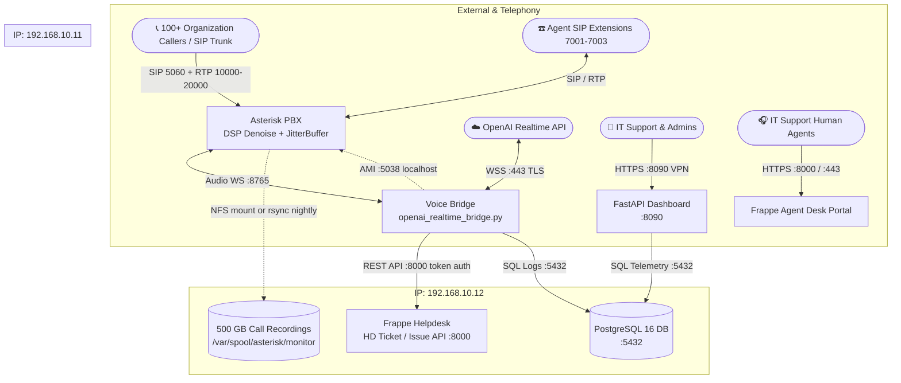

# 2-VM Production Deployment & Wiring Guide — AI IT Support Agent ("Arif")

This guide provides the complete, production-grade deployment architecture for running the National Finance AI Support Agent across your **2 dedicated Virtual Machines**.

---

## 1. Resource Allocation & Architecture Blueprint

### Compute Sizing Summary

| Virtual Machine | Compute Specs | Primary Role | Hosted Services |
|---|---|---|---|
| **VM 1: Voice & Edge** | **12 vCPU · 24 GB RAM · 300 GB SSD** | **Telephony & Realtime AI Processing** | • Asterisk PBX 20+ (SIP / RTP / Speex Denoise)<br/>• Python OpenAI Realtime Bridge (:8765)<br/>• FastAPI Telemetry Dashboard (:8090)<br/>• Asterisk AMI (:5038 localhost) |
| **VM 2: Core & Data** | **16 vCPU · 32 GB RAM · 500 GB SSD** | **Helpdesk, Database & Archival** | • Frappe Helpdesk / ERPNext Support (:8000 / :443)<br/>• PostgreSQL 16 Enterprise Database (:5432)<br/>• Redis Cache & Background Queue Workers<br/>• Call Recordings Storage (500 GB = 70,000+ hrs) |

---

## 2. End-to-End Wiring & Network Topology



---

## 3. Network Ports & Firewall Rules

Assuming private network IPs:
- **VM 1 (Voice Edge)**: `192.168.10.11`
- **VM 2 (Core Helpdesk)**: `192.168.10.12`

### 3.1 Firewall on VM 1 (`192.168.10.11`)

Execute on VM 1:

```bash
sudo ufw default deny incoming
sudo ufw default allow outgoing

# Administration
sudo ufw allow from 192.168.10.0/24 to any port 22 proto tcp comment 'SSH Internal'

# Telephony Inbound from Telecom / SBC Provider
sudo ufw allow 5060/udp comment 'SIP Signaling'
sudo ufw allow 5060/tcp comment 'SIP Signaling TCP'
sudo ufw allow 5061/tcp comment 'SIP TLS'
sudo ufw allow 10000:20000/udp comment 'RTP Audio Stream'

# Ops Dashboard (Internal VPN / Office Network Only)
sudo ufw allow from 192.168.10.0/24 to any port 8090 proto tcp comment 'Dashboard Internal'

# Strictly keep 8765 and 5038 loopback only
sudo ufw enable
sudo ufw status verbose
```

### 3.2 Firewall on VM 2 (`192.168.10.12`)

Execute on VM 2:

```bash
sudo ufw default deny incoming
sudo ufw default allow outgoing

# Administration
sudo ufw allow from 192.168.10.0/24 to any port 22 proto tcp comment 'SSH Internal'

# Allow VM 1 to access PostgreSQL
sudo ufw allow from 192.168.10.11 to any port 5432 proto tcp comment 'PostgreSQL from VM1'

# Allow VM 1 (Bridge) and Human Agents to access Frappe Helpdesk
sudo ufw allow from 192.168.10.0/24 to any port 8000 proto tcp comment 'Frappe Helpdesk HTTP'
sudo ufw allow from 192.168.10.0/24 to any port 443 proto tcp comment 'Frappe Helpdesk HTTPS'

sudo ufw enable
sudo ufw status verbose
```

---

## 4. Step-by-Step Setup: VM 2 (Helpdesk & Database Core)

Deploy VM 2 first so that database endpoints and Frappe API tokens are ready for VM 1.

### 4.1 Install Base Dependencies & Docker

```bash
sudo apt update && sudo apt upgrade -y
sudo apt install -y curl git ufw jq software-properties-common postgresql-client

# Install Docker & Docker Compose
curl -fsSL https://get.docker.com -o get-docker.sh
sudo sh get-docker.sh
sudo usermod -aG docker $USER
newgrp docker
docker compose version
```

### 4.2 Deploy PostgreSQL 16 (Central Telemetry & System DB)

```bash
sudo apt install -y postgresql-16 postgresql-contrib-16
```

Configure PostgreSQL to listen on the internal network:

```bash
sudo nano /etc/postgresql/16/main/postgresql.conf
```
Set:
```ini
listen_addresses = 'localhost,192.168.10.12'
```

Allow VM 1 in `/etc/postgresql/16/main/pg_hba.conf`:
```ini
# TYPE  DATABASE        USER            ADDRESS                 METHOD
host    ai_dashboard    ai_user         192.168.10.11/32        scram-sha-256
```

Create user and database:
```bash
sudo -u postgres psql -c "CREATE USER ai_user WITH ENCRYPTED PASSWORD 'SECURE_DB_PASSWORD_HERE';"
sudo -u postgres psql -c "CREATE DATABASE ai_dashboard OWNER ai_user;"
sudo systemctl restart postgresql
```

Test connection locally:
```bash
PGPASSWORD='SECURE_DB_PASSWORD_HERE' psql -h 127.0.0.1 -U ai_user -d ai_dashboard -c '\l'
```

### 4.3 Deploy Frappe Helpdesk via Docker Compose

```bash
mkdir -p /opt/frappe-helpdesk && cd /opt/frappe-helpdesk
git clone https://github.com/frappe/helpdesk.git .
```

Start the containers:
```bash
docker compose up -d
```

Confirm all services are running (`nginx`, `gunicorn`, `redis`, `worker`):
```bash
docker compose ps
```

### 4.4 Generate API Key & Secret for Arif in Frappe

1. Log into Frappe Desk (`http://192.168.10.12:8000`) as Administrator.
2. Navigate to: **Users** → **Add User** → Name: `Arif Voice Agent`, Email: `arif.agent@nationalfinance.com`, Role: `Helpdesk Agent` / `System Manager`.
3. Open user profile → Click **Settings** → **API Access** → Click **Generate Keys**.
4. Note down:
   - **API Key**: `e.g. 9812a1b32d4e5f6`
   - **API Secret**: `e.g. 7890f1e2d3c4b5a`

### 4.5 Configure Frappe SLA Policies & Teams

1. Go to **HD Team** → Create team: `IT Support`.
2. Go to **Service Level Agreement**:
   - **P0_EXECUTIVE**: Response Time: **15 mins**, Resolution: **2 hours**
   - **P1_EMERGENCY**: Response Time: **10 mins**, Resolution: **1 hour**
   - **P2_HIGH**: Response Time: **1 hour**, Resolution: **4 hours**
   - **P3_MEDIUM**: Response Time: **4 hours**, Resolution: **1 business day**
   - **P4_LOW**: Response Time: **8 hours**, Resolution: **3 business days**

---

## 5. Step-by-Step Setup: VM 1 (Voice & Telephony Edge)

### 5.1 Install Asterisk 20 with SpeexDSP Noise Reduction

```bash
sudo apt update && sudo apt upgrade -y
sudo apt install -y build-essential libxml2-dev libncurses5-dev libsqlite3-dev \
  libssl-dev libjansson-dev libspeex-dev libspeexdsp-dev uuid-dev libedit-dev

# Install Asterisk 20 LTS
cd /usr/src
sudo curl -O http://downloads.asterisk.org/pub/telephony/asterisk/asterisk-20-current.tar.gz
sudo tar -zxvf asterisk-20-current.tar.gz
cd asterisk-20.*
sudo contrib/scripts/install_prereq install
sudo ./configure --with-speex --with-speexdsp
sudo make menuselect.makeopts
# Ensure app_queue, codec_speex, func_speex, func_denoise, res_pjproject are enabled
sudo menuselect/menuselect --enable func_denoise --enable app_queue menuselect.makeopts
sudo make -j$(nproc)
sudo make install
sudo make samples
sudo make config
sudo ldconfig
```

### 5.2 Configure Asterisk Audio DSP & Multi-Queue Dialplan

Edit `/etc/asterisk/extensions.conf`:

```ini
[general]
static=yes
writeprotect=no

[from-internal]
; -----------------------------------------------------------------------------
; AI Support Inbound Entry Point
; -----------------------------------------------------------------------------
exten => 7000,1,Answer()
 same => n,Set(JITTERBUFFER(adaptive)=default) ; Adaptive jitter buffer
 same => n,Set(DENOISE(rx)=on)                 ; Eliminate background murmur / AC hum
 same => n,Set(DENOISE(tx)=on)
 same => n,Set(CHANNEL(hangup_handler_push)=sub-hangup,s,1)
 same => n,AudioSocket(127.0.0.1:8765)         ; Stream audio to Python Voice Bridge
 same => n,Hangup()

; -----------------------------------------------------------------------------
; Escalation Queues (AMI Redirect Targets)
; -----------------------------------------------------------------------------
; Standard L1 IT Support Queue
exten => 7001,1,Answer()
 same => n,Set(JITTERBUFFER(adaptive)=default)
 same => n,Queue(it-support,t,,,300)
 same => n,Hangup()

; Executive & VIP Concierge Queue (CEO, CFO, C-Suite)
exten => 7002,1,Answer()
 same => n,Set(JITTERBUFFER(adaptive)=default)
 same => n,Queue(it-vip-exec,t,,,60)
 same => n,Hangup()

; Sev-1 Emergency & Outage Incident Response Queue
exten => 7003,1,Answer()
 same => n,Set(JITTERBUFFER(adaptive)=default)
 same => n,Queue(it-emergency,t,,,30)
 same => n,Hangup()

[sub-hangup]
exten => s,1,NoOp(Call ended)
 same => n,Return()
```

Edit `/etc/asterisk/queues.conf`:

```ini
[general]
persistentmembers = yes
autofill = yes
monitor-type = MixMonitor

[it-support]
musicclass=default
strategy=ringall
timeout=20
retry=5
maxlen=20
joinempty=yes
leavewhenempty=no

[it-vip-exec]
musicclass=default
strategy=ringall
timeout=15
retry=2
maxlen=5
joinempty=yes
leavewhenempty=no

[it-emergency]
musicclass=default
strategy=ringall
timeout=10
retry=1
maxlen=10
joinempty=yes
leavewhenempty=no
```

Edit `/etc/asterisk/manager.conf`:

```ini
[general]
enabled = yes
port = 5038
bindaddr = 127.0.0.1

[aiagent]
secret = S3cur3AMIP@ssw0rd!
read = system,call,command,agent,user,originate
write = system,call,command,agent,user,originate
```

Reload Asterisk:

```bash
sudo asterisk -rx "dialplan reload"
sudo asterisk -rx "module reload app_queue.so"
sudo asterisk -rx "manager reload"
```

### 5.3 Deploy the Modernized AI Support Agent on VM 1

```bash
cd /opt
sudo git clone <YOUR_GIT_REPO_URL> ai-support-agent
cd /opt/ai-support-agent

# Create virtualenv
python3 -m venv venv
source venv/bin/activate
pip install --upgrade pip
pip install -r requirements.txt || pip install fastapi uvicorn websockets python-dotenv requests python-multipart jinja2
```

### 5.4 Configure `.env` on VM 1

Create `/opt/ai-support-agent/.env`:

```ini
# OpenAI Realtime Configuration
OPENAI_API_KEY="sk-proj-YOUR_ACTUAL_OPENAI_API_KEY"
OPENAI_REALTIME_MODEL="gpt-realtime"

# Ticketing System: Pointing to VM 2 Frappe Helpdesk
TICKETING_SYSTEM="frappe"
FRAPPE_URL="http://192.168.10.12:8000"
FRAPPE_API_KEY="API_KEY_GENERATED_ON_VM2"
FRAPPE_API_SECRET="API_SECRET_GENERATED_ON_VM2"
FRAPPE_TICKET_DOCTYPE="HD Ticket"
FRAPPE_DEFAULT_TEAM="IT Support"

# Telephony & Multi-Queue Configuration
ASTERISK_AMI_HOST="127.0.0.1"
ASTERISK_AMI_PORT=5038
ASTERISK_AMI_USER="aiagent"
ASTERISK_AMI_SECRET="S3cur3AMIP@ssw0rd!"
ASTERISK_TRANSFER_CONTEXT="from-internal"

# Escalation Queues
ASTERISK_QUEUE_STANDARD="7001"
ASTERISK_QUEUE_EXECUTIVE="7002"
ASTERISK_QUEUE_EMERGENCY="7003"

# Voice Activity Detection (VAD) Tuned for Office Noise
VAD_THRESHOLD=0.65
VAD_SILENCE_MS=750
VAD_IDLE_TIMEOUT_MS=30000

# Concurrency & Sizing
MAX_CONCURRENT_CALLS=25
CALL_MAX_SECONDS=1800

# Dashboard Security & Network Binding
DASHBOARD_SECRET="A_STRONG_RANDOM_32_CHAR_SECRET_KEY_HERE"
DASHBOARD_COOKIE_SECURE="false"
DASHBOARD_HOST="127.0.0.1"
DASHBOARD_PORT=8090
# Optional: Set initial admin password for headless deployment.
# If left empty, visiting the dashboard redirects to the secure /setup wizard to define admin credentials.
INITIAL_ADMIN_PASSWORD="YourSecureAdminPassword123!"
```

### 5.5 Create Systemd Services on VM 1

**Service 1: AI Realtime Bridge (`/etc/systemd/system/ai-support-bridge.service`)**:

```ini
[Unit]
Description=AI Support Agent Realtime Bridge
After=network-online.target asterisk.service
Wants=network-online.target
Requires=asterisk.service

[Service]
Type=simple
WorkingDirectory=/opt/ai-support-agent
Environment=PYTHONPATH=/opt/ai-support-agent
ExecStart=/opt/ai-support-agent/venv/bin/python /opt/ai-support-agent/app/openai_realtime_bridge.py
Restart=always
RestartSec=3
User=root

# Limit adjustments for high concurrency
LimitNOFILE=65536

[Install]
WantedBy=multi-user.target
```

**Service 2: Dashboard Ops UI (`/etc/systemd/system/ai-dashboard.service`)**:

```ini
[Unit]
Description=AI IT Support Telemetry Dashboard
After=network.target

[Service]
Type=simple
WorkingDirectory=/opt/ai-support-agent
Environment=PYTHONPATH=/opt/ai-support-agent
ExecStart=/opt/ai-support-agent/venv/bin/uvicorn dashboard.app:app --host 0.0.0.0 --port 8090 --workers 4
Restart=always
RestartSec=5
User=root

[Install]
WantedBy=multi-user.target
```

Enable and start services:

```bash
sudo systemctl daemon-reload
sudo systemctl enable ai-support-bridge ai-dashboard
sudo systemctl restart ai-support-bridge ai-dashboard
```

Verify status:

```bash
sudo systemctl status ai-support-bridge
sudo systemctl status ai-dashboard
sudo ss -lntp | grep -E "8765|8090"
```

---

## 6. End-to-End Validation & Verification Plan

### Test 1: Cross-VM Network Connectivity
From VM 1, verify connection to VM 2 services:

```bash
# Verify Frappe Helpdesk port
nc -zv 192.168.10.12 8000

# Verify PostgreSQL port
nc -zv 192.168.10.12 5432

# Verify Frappe API authentication from VM 1
curl -s -H "Authorization: token YOUR_KEY:YOUR_SECRET" \
  http://192.168.10.12:8000/api/resource/HD%20Ticket?limit=1 | jq .
```

### Test 2: Audio & Concurrency Load Simulation
Run 5 concurrent calls into Asterisk extension `7000`:
- Verify no audio stuttering / broken drum sound.
- Confirm Asterisk jitter buffer stays balanced (`asterisk -rx "core show channels verbose"`).
- Confirm speech stops immediately when caller speaks (Barge-in verified).

### Test 3: Executive Fast-Track Test
Place a test call spoofing or originating from CEO number `+96899000001`:
1. Arif identifies caller as Khalid Al Harthy immediately.
2. Arif speaks personalized executive greeting without asking for employee ID.
3. Call redirects cleanly to Queue `7002` (Executive Concierge).

### Test 4: Emergency Escalation Test
Call in and state: *"Our core banking database is down and branches are offline"*:
1. Arif detects critical emergency trigger words.
2. A P1 Critical ticket is created immediately in Frappe Helpdesk.
3. Call transfers to Queue `7003` (Incident Engineering Response Team).

### Test 5: Small Issue Deflection & Auto-Ticket
Call in with an account lockout issue:
1. Arif guides the user through the knowledge base steps.
2. User states *"That worked, thank you!"*.
3. Arif creates an auto-ticket with status `Resolved` and logs `ai_deflected=1` in telemetry.

---

## 7. Disaster Recovery & Backup Plan

1. **Daily Database Dumps (VM 2)**:
   ```bash
   crontab -e
   # Run daily at 02:00 AM
   0 2 * * * pg_dump -U ai_user -h 127.0.0.1 ai_dashboard | gzip > /backup/db/dashboard_$(date +\%F).sql.gz
   ```
2. **Call Recordings Pruning**:
   Keep 90 days of recordings on VM 2; automatically compress or purge older files:
   ```bash
   0 3 * * * find /var/spool/asterisk/monitor/ -name "*.wav" -mtime +90 -delete
   ```
3. **VM 1 Failover / Configuration Backup**:
   Archive `/etc/asterisk` and `/opt/ai-support-agent/.env` weekly to VM 2.
